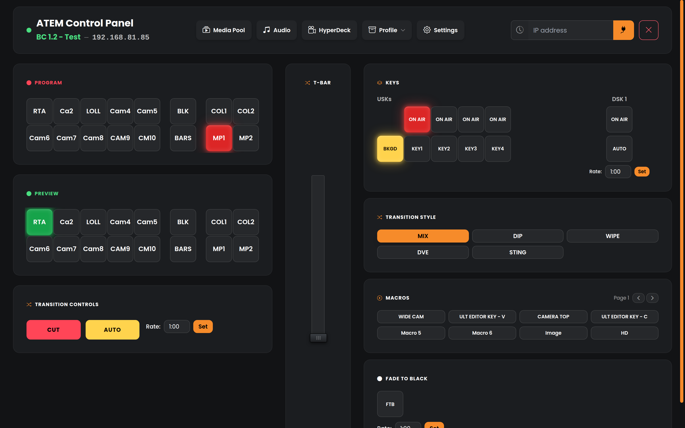
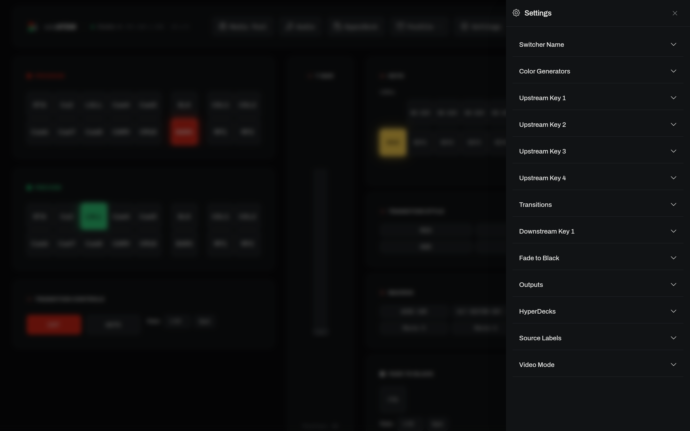
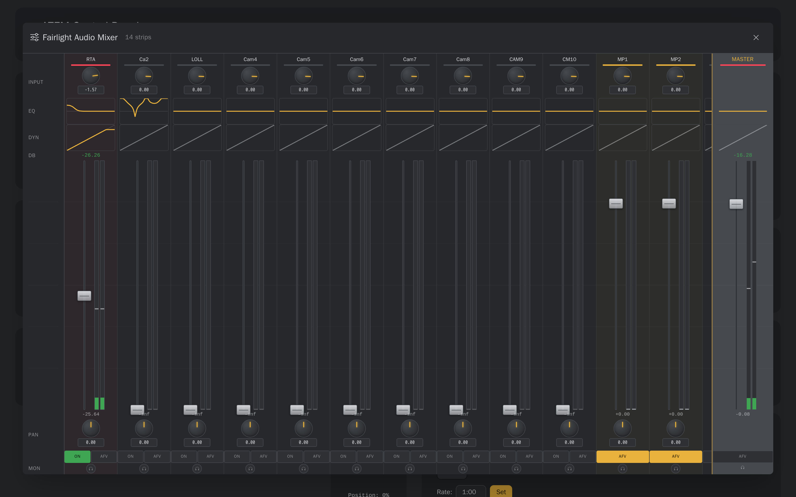
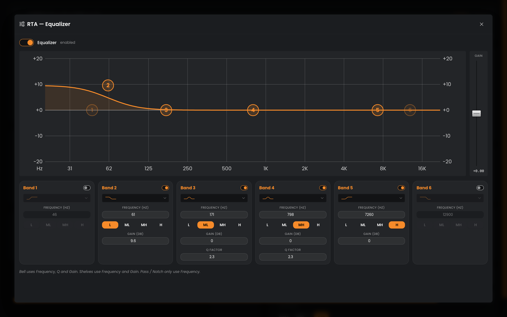

# WebATEM

**Control your Blackmagic ATEM switcher from any browser.** WebATEM finds the
ATEMs on your network and gives you a full control surface — switching,
keyers, audio, media pool, macros — at a URL, on any device.

<p align="center">
  <a href="https://github.com/lucas-romanenko/webatem/releases/latest/download/webatem-windows-x64.exe"></a>
  &nbsp;
  <a href="https://github.com/lucas-romanenko/webatem/releases/latest/download/webatem-macos-arm64.dmg"></a>
  &nbsp;
  <a href="https://github.com/lucas-romanenko/webatem/releases/latest/download/webatem-linux-x64"></a>
</p>
<p align="center"><sub>Download it, open it, and your switchers appear. &nbsp;·&nbsp; Intel Mac? <a href="https://github.com/lucas-romanenko/webatem/releases/latest/download/webatem-macos-intel.dmg">Intel build</a> &nbsp;·&nbsp; The Linux build runs on desktop <b>and</b> headless servers.</sub></p>

Three ways to run it, all simple:

- **Just you, right now** → **download it** for your Mac or Windows machine
  and open it. It lives in your menu bar / system tray (with a *Start at
  login* switch), opens your browser, and your switchers appear. Like ATEM
  Software Control, but in your browser — and on every device on the network.
- **Your whole team, always on** → **host it** on a Linux box, VM or Raspberry
  Pi with one Docker command; everyone opens a URL — no installs, no accounts.
- **Already have Python?** → `pipx install webatem`, then `webatem`.

Every way of running it **auto-discovers the ATEMs on your network**
(Bonjour/mDNS) and lists them by name, exactly like ATEM Software Control.

<p align="center">
  
</p>

---

## Get started

### Option A — Download it  *(Mac, Windows)*

1. Click your platform's **Download** button at the top (or the
   [Releases](https://github.com/lucas-romanenko/webatem/releases) page).
2. Open it. The icon appears in the menu bar / tray and the launcher window
   comes up: pick the interface and port if the defaults are not right, then
   **Launch GUI** opens the control page in your browser with the ATEMs on
   your network listed. Pick one and you're controlling it.

That's the whole setup — nothing to install alongside it, no Python, no Docker.

While it runs it is a small window plus an icon in the **menu bar (Mac) /
system tray (Windows)**, the way Bitfocus Companion works — nothing in the
Dock or on the taskbar, only the icon. The window shows
**Running** and the address other devices use, and holds the settings:
**Interface** (all of them, one adapter, or this computer only), **Port**,
**Start minimized**, **Run at login**, with **Launch GUI** (opens the control
page in your browser), **Hide** and **Quit**. Closing the window just hides
it; the tray menu is three items — **Show/Hide window**, **Launch GUI**,
**Quit**. Changing the interface or port restarts the server on the new
address right there; handy on a laptop with Wi-Fi, Ethernet and a VPN at
once. **Launch GUI** opens the address shown — the real interface and port,
the same one other devices use. (This computer also answers at `127.0.0.1`
whichever interface is chosen, and if that interface is gone at the next
start WebATEM listens on all interfaces and says so.) The same settings are behind
the gear on the connect page. The default port is **8880** (Bitfocus
Companion has 8000); if the port is taken anyway, the next free one is used
and the window says so.

<details>
<summary><b>First-launch security prompt</b> (the app isn't code-signed yet)</summary>

Because the downloads aren't signed with a paid developer certificate, the OS
warns you the first time. One-time, then it opens normally:

- **macOS:** double-click, let it get blocked, then **System Settings →
  Privacy & Security → “Open Anyway”**. (On older macOS: right-click → Open.)
- **Windows:** **More info → Run anyway** on the SmartScreen prompt.

Removing the warning entirely requires paid Apple/Microsoft signing
certificates — planned, not done yet.
</details>

### Option B — Host it  *(a whole team; always on)*

Run it on a **Linux box, VM or Raspberry Pi on the same network as your
ATEMs** (the ATEM-Software-Control-on-a-server model). The published image
is built for amd64 and arm64:

```bash
docker run -d --name webatem --network host --restart unless-stopped \
  -v webatem-data:/app/data ghcr.io/lucas-romanenko/webatem:latest
```

Open `http://<that-box>:8880` from any device on the network. It comes back
automatically on reboot. No `.env` file needed — every setting has a working
default (SQLite DB + a generated secret key live in the `webatem-data`
volume); see [.env.example](.env.example) for knobs like `PORT`, `TIME_ZONE`,
`ALLOWED_HOSTS`. (In Docker the address and port come from that environment,
so the connect page's Server settings show them read-only.) Prefer Compose? The repository's
[compose.yml](compose.yml) runs the same image: `docker compose up -d`.

Without Docker: the `webatem-linux-x64` binary from the Releases page runs
headless too — on a machine with no display it skips the browser and tray and
prints the address to open from another device:

```
WebATEM is running.
  On this machine:      http://127.0.0.1:8880/atem/
  From another device:  http://192.168.1.50:8880/atem/
```

Keep it up with a systemd unit, `tmux` or `nohup`.

> **Why Linux for hosting?** Discovery needs the app to see your LAN directly.
> That works natively on Linux (the container uses host networking). Docker
> Desktop on **Mac/Windows** runs containers in a VM that can’t see LAN
> discovery traffic — so on a Mac or PC, use the download (Option A) or pipx
> (Option C), not Docker.

### Option C — pipx  *(you already have Python 3.10+)*

```bash
pipx install webatem      # or: uvx webatem, with no install at all
webatem
```

Same behaviour as the download: a native process on your real network, the
tray icon and the launcher window appear where there is a desktop. Prebuilt wheels
for every platform mean no compiler is needed. Upgrade with
`pipx upgrade webatem`.

---

## Finding your switchers

Three ways, in order of magic:

1. **Automatic (Bonjour/mDNS).** On the same network as your ATEMs, they show
   up under **“On Your Network”** with their names, no typing. This is what
   ATEM Software Control does.
2. **Scan subnet.** For ATEMs that don’t advertise over Bonjour, type your
   subnet (e.g. `192.168.1`) and hit **Scan** — it finds them by IP.
3. **Manual IP.** Type an address and connect. Recent connections are
   remembered for one-click reconnect.

> Automatic discovery is **same-network only** — Bonjour/mDNS is link-local
> and doesn’t cross a router or VPN (this is true of ASC too). Reaching your
> ATEMs over a **VPN**? Auto-discovery won’t see them, but **Scan** and
> **manual IP** work fine over the tunnel.

---

## WebATEM vs. ATEM Software Control

ATEM Software Control (ASC) is Blackmagic’s own free control app, and it’s
excellent — WebATEM isn’t trying to replace all of it. The difference is
*access*: ASC is a desktop app tied to one machine; WebATEM is a control
surface any device on your network can open (and you can still run it locally
like ASC if you want).

|  | **WebATEM** | **ATEM Software Control** |
|---|---|---|
| **Runs on** | Any browser — Windows, macOS, **Linux**, ChromeOS, iPad, phone | Windows & macOS desktop only |
| **Client install** | None — just open a URL | Installed per machine |
| **Access from** | Any device on the network | The machine it’s installed on |
| **Multiple operators** | One shared switcher session, many operators | Each machine opens its own session |
| **Phones / tablets** | ✓ Responsive | ✗ |
| **How to run** | Download it, host one instance for everyone (Docker), or `pipx install webatem` | Install on each machine |
| **Price** | Free, open source | Free (proprietary) |
| **Feature breadth** | Core: switching, keyers, Fairlight audio, media pool, macros, profiles, HyperDeck | Everything, incl. camera control (CCU), streaming & recording, SuperSource |
| **Support** | Community / self-hosted | Official Blackmagic |

**Reach for ASC** when you need the full feature set on one operator’s machine
— camera control, streaming/recording, SuperSource, recording macros.

**Reach for WebATEM** when you want the core control surface available to
anyone on the network, on any device or OS — a second operator on an iPad, a
Linux box in the rack room, a phone at the camera position.

## Features

- **Full switcher control** — program/preview buses per M/E, cut/auto,
  transition styles (mix, dip, wipe, DVE, stinger) with per-style settings,
  fade to black, color generators, aux routing, source renaming that follows
  live switcher labels.
- **Upstream & downstream keyers** — USK 1–4 (luma, chroma, pattern, DVE with
  fly keyframes, masks), DSKs with tie/rate/clip/gain, on-air countdowns.
- **Fairlight audio** — per-strip faders, EQ, dynamics, master bus, and live
  audio meters streamed over WebSocket (tab-gated so idle pages cost nothing).
- **Media pool** — live thumbnails of every still slot, and drag-and-drop
  image upload straight onto a slot (validated and resized to 1080p
  server-side).
- **Macros** — browse and run switcher macros.
- **Save/restore switcher state** — full switcher profile export/import as
  XML, compatible with ATEM Software Control’s “Save Switcher State”,
  including media pool images and macro bytecode.
- **HyperDeck transport** — clip browser and play/pause/stop/loop for decks
  bound to the ATEM (TCP/9993), from the same page.
- **Multi-operator by design** — one pooled connection per switcher shared by
  all operators; state fan-out over WebSockets with adaptive polling
  (30 ms during transitions, relaxed when idle).

Deep per-switcher settings live in the Settings panel — color generators,
each upstream keyer (luma / chroma / pattern / DVE), downstream keyers,
transitions, video mode, input labels, outputs and HyperDecks:

<p align="center">
  
</p>

Full **Fairlight audio** — a per-strip mixer with input gain, EQ and dynamics
curves, faders, pan and live meters, plus a writable 6-band parametric EQ with
a live frequency-response graph:

<p align="center">
  
</p>
<p align="center">
  
</p>

## Running it for real

- **There is no login — by design.** Like the hardware panel, anyone who can
  reach the page can control your switchers. Keep it on the studio network. If
  you must expose it further, put your reverse proxy’s auth (basic auth, SSO)
  and TLS in front, and set `CSRF_TRUSTED_ORIGINS=https://your.host`.
- **Web pages can’t drive it cross-origin.** The control WebSocket only
  accepts browser connections from the app’s own pages (same-origin), so a
  malicious website open in an operator’s browser can’t reach the switchers.
  If your reverse proxy rewrites `Host`, list the browser-facing host in
  `WEBSOCKET_ALLOWED_ORIGINS`.
- It talks raw UDP to switchers on port 9910 (the ATEM protocol has no
  authentication — that’s the hardware, not this app), so it needs to be on a
  network that can reach them.
- **Single instance, by design.** The switcher connection pool, media-pool
  watcher, and channel layer are process-local; one instance handles many
  switchers and operators. Don’t run several against the same switchers.
- Stills upload/capture assume **1080p** switchers (all production use so far).
  Non-1080p ATEMs connect and control fine; media features are untested there.

## Architecture

```
Browser (Alpine.js + WebSockets)
   │  ws/atem/ · HTTP
   ▼
Django + Channels (single ASGI worker, uvicorn)
   │  pooled UDP session per switcher (atemwire)
   ▼
ATEM switchers (UDP 9910) · HyperDecks (TCP 9993 / FTP)
```

- **[atemwire](https://github.com/lucas-romanenko/bmdwire/tree/main/atemwire)** (PyPI) — the
  ATEM protocol library, a substantially modified fork of Martijn Braam's
  pyatem: declarative wire-format DSL, hardened UDP transport (in-order
  delivery, retransmit serving, clean session close), ref-counted connection
  pooling, native interleaved bulk transfers, macro bytecode transfer, and
  ASC-compatible profile save/restore. A small C extension does YCbCr↔RGB
  conversion. **[hyperdeckwire](https://github.com/lucas-romanenko/bmdwire/tree/main/hyperdeckwire)**
  (PyPI) drives the HyperDecks. Both are pinned in `pyproject.toml`; a
  library change is a release there and a pin bump here (Dependabot opens it,
  CI runs, it merges itself).
- **`atem_control/`** — the Django app: the WebSocket consumer, a declarative
  command dispatch table, the media-pool watcher, LAN discovery, and the UI.
- **`webatem/`** — the project package: settings, the ASGI entry, the
  WebSocket origin guard, and `launcher.py` — the `webatem` command that runs
  the same web app locally and lives in the tray with its launcher window. The
  downloads are that launcher frozen per OS by PyInstaller
  (`build/desktop/`); the PyPI package is the same code installed by pip.
- **One tag, three deliverables.** A `v*` tag publishes the Mac / Windows /
  Linux downloads to the GitHub release, the Docker image to GHCR (amd64 +
  arm64) and the `webatem` package to PyPI.
- **SQLite** for persistence (connection history) — no external database.

## Development

```bash
git clone https://github.com/lucas-romanenko/webatem.git
cd webatem
npm install && npm run build:css      # the stylesheet — without it the app renders unstyled
pip install -e ".[test]"              # Python 3.10+; the device libraries install as wheels
python -m webatem                     # the launcher: server + tray + window
python -m pytest tests/ -q            # the suite (no hardware needed)
```

Or entirely in Docker: `docker compose up -d --build` runs the app and
`docker compose exec webatem pytest tests/ -q` runs the suite in it. The suite
(the command dispatch table, the T-bar, the consumer's state-change and
session-cleanup rules, upload policy, tally safety, profile dialogs, the
media-pool thumbnail cache, LAN discovery identity, WebSocket origin checks)
runs against fake protocol layers. CI runs it on every push. The protocol
libraries carry their own suites in [bmdwire](https://github.com/lucas-romanenko/bmdwire).

`python manage.py runserver` works too for plain Django development. The
per-OS downloads are built by the **Desktop builds** workflow
(`pyinstaller build/desktop/webatem.spec`); the control page itself is
synced from its upstream application by `tools/sync_from_av_server.py`.

## License

- Application code: [MIT](LICENSE).
- The ATEM protocol library, [atemwire](https://github.com/lucas-romanenko/bmdwire/tree/main/atemwire),
  is a separate package (a fork of the [OpenAtem pyatem
  library](https://git.sr.ht/~martijnbraam/pyatem)) and is **LGPL-3.0-only**;
  WebATEM uses it as an installed dependency, unmodified.
  [hyperdeckwire](https://github.com/lucas-romanenko/bmdwire/tree/main/hyperdeckwire) is MIT.
- Bundled frontend assets (Alpine.js and its collapse plugin, Bootstrap Icons,
  Tailwind/daisyUI) are MIT and the Poppins font is OFL — notices in
  [THIRD_PARTY_LICENSES.md](THIRD_PARTY_LICENSES.md).

Security posture and how to report vulnerabilities: [SECURITY.md](SECURITY.md).

Not affiliated with or endorsed by Blackmagic Design. ATEM and HyperDeck are
trademarks of Blackmagic Design Pty Ltd. Use against production hardware at
your own risk.
